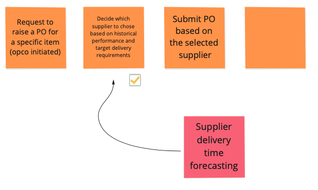
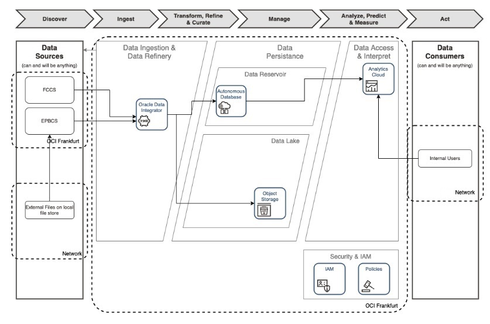
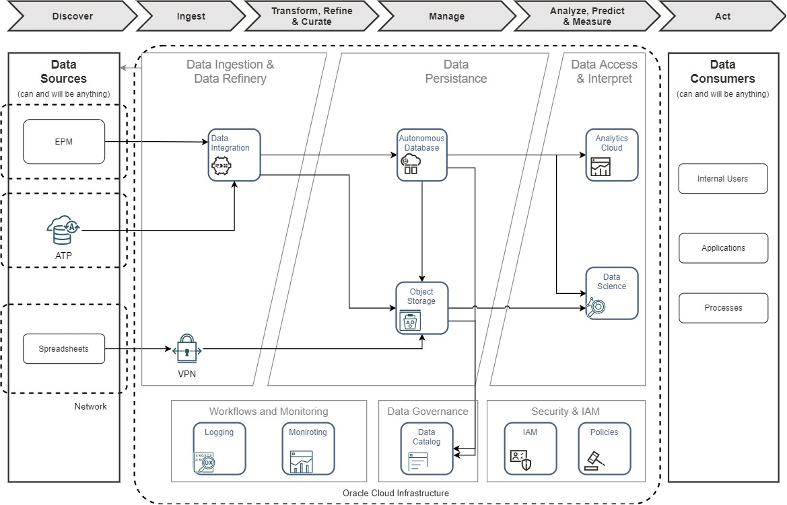
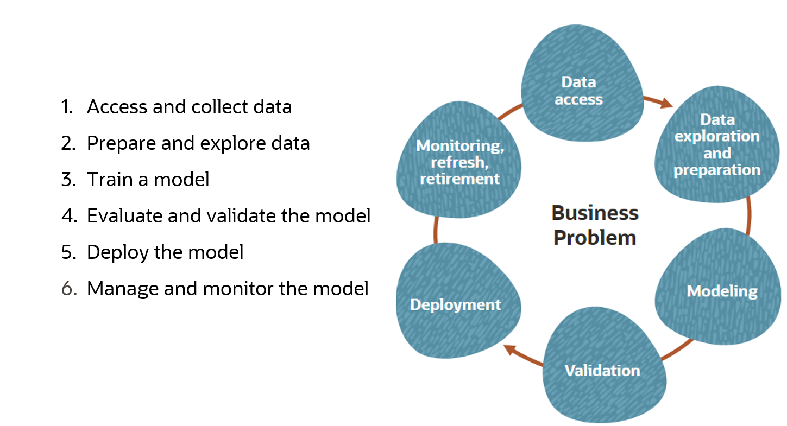
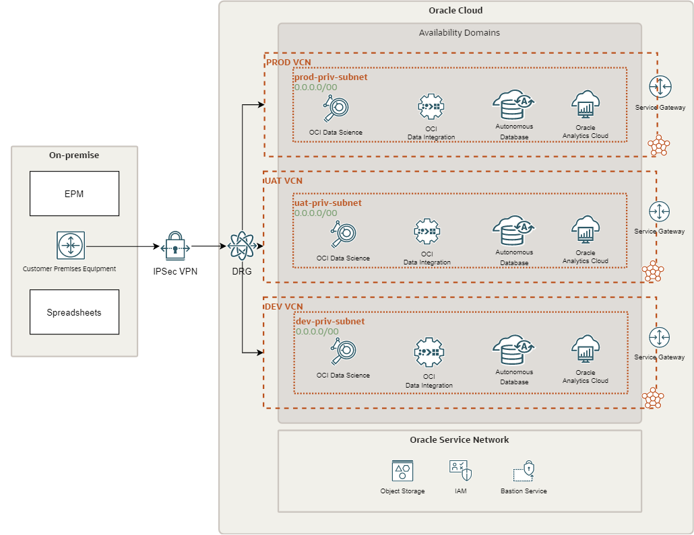
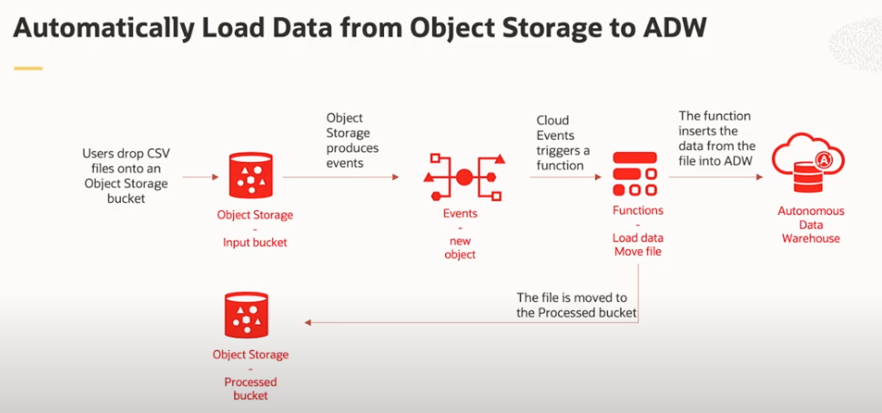
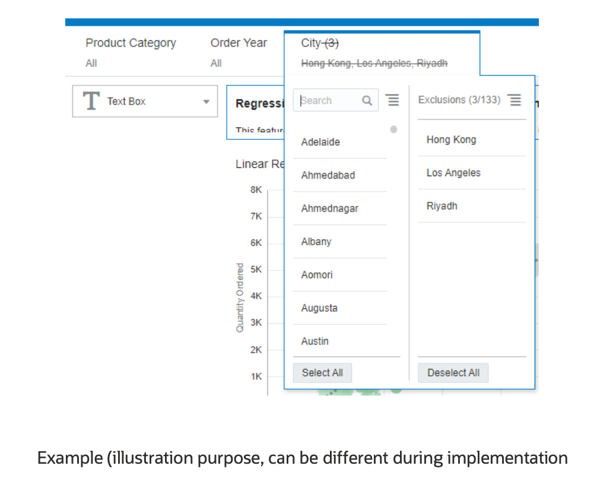

# Document Control

## Version Control

<table>
<caption></caption>
<colgroup>
<col style="width: 10%" />
<col style="width: 30%" />
<col style="width: 20%" />
<col style="width: 40%" />
</colgroup>
<thead>
<tr class="header">
<th style="text-align: left;">Version</th>
<th style="text-align: left;">Authors</th>
<th style="text-align: left;">Date</th>
<th style="text-align: left;">Comments</th>
</tr>
</thead>
<tbody>
<tr class="odd">
<td style="text-align: left;">1.3</td>
<td style="text-align: left;">Ismael Hassane</td>
<td style="text-align: left;">7 August 2023</td>
<td style="text-align: left;">Public version</td>
</tr>
</tbody>
</table>

## Table of Acronyms

| Term | Meaning                                           |
| :--- | :------------------------------------------------ |
| AD   | Availability Domain                               |
| ADB  | Autonomous Database including ATP, ADW, AJD, etc. |
| ADW  | Autonomous Data Warehouse                         |
| ATP  | Autonomous Transaction Processing                 |
| DEV  | Development Environment                           |
| DI   | Data Integration                                  |
| DLH  | Data Lakehouse                                    |
| DRG  | Dynamic Routing Gateway                           |
| DWH  | Data Warehouse                                    |
| ELT  | Extract-Load-Transform                            |
| ETA  | Estimated Time of Arrival                         |
| IaaS | Infrastructure as a Service                       |
| LB   | Load Balancer                                     |
| NSG  | Network Security Group                            |
| OCI  | Oracle Cloud Infrastructure                       |
| PROD | Production Environment                            |
| SLA  | Service Level Agreement                           |
| UAT  | User Acceptance Test Environment                  |
| VCN  | Virtual Cloud Network                             |

## Team

| Name         | Email             | Role                   | Company |
| :----------- | :---------------- | :--------------------- | :------ |
| Name Surname | name@example.com  | Solution Architect     | example |
| Name Surname | name@lexample.com | Account Cloud Engineer | example |

## Document Purpose

This document provides a high-level solution definition for the Oracle solution and aims at describing the current state, current state requirements, and to-be state. 

The document may refer to a ‘Workload’, which summarizes the full technical solution for a customer (You) during a single engagement. The Workload is described in the chapter [Workload Requirements and Architecture](#workload-requirements-and-architecture).

This is a living document, additional sections will be added as the engagement progresses resulting in a final Document to be handed over to the \<Service Provider\>.

# Business Context

*Describe the customer's business and background. What is the context of the customer's industry and LoB? What are the business needs and goals which this Workload is an enabler for? How does this technical solution impact and support the customer's business goals? Does this solution support a specific customer strategy, or maybe certain customer values? How does this solution help our customers to either generate more revenue or save costs?*

## Executive Summary

-   Brief history of the Customer

-   Current Solution and Rationale for moving to Oracle Cloud Infrastructure (OCI)

## Workload Business Value

Building a Machine learning-based model is an opportunity for increasing supply forecasting accuracy. Which will help the entity reach the perfect order fulfillment. Machine learning also will help to forecast supplier's delivery time and to source from the right suppliers, for the right product item at the right time which in turn will help in reducing DIO (Days Inventory Outstanding - working capital). 

The entity wants to migrate the existing Data Warehouse and BI system to Oracle Cloud, in order to modernize the system, provide new analytical features to users, and to better manage the costs of the system. It plans to migrate to Autonomous Data Warehouse (ADW) and Oracle Analytics Cloud (OAC).

This document provides a high-level solution definition for the Oracle solution and aims at describing the current state, to-be state as well as a potential 'OCI' project scope and timeline. The project will be described as a physical implementable solution. The purpose is to provide all parties involved a clear and well-defined insight into the scope of work and intention of the project. 

# Workload Requirements and Architecture

## Overview
Suppliers' lead time forecasting and risk assessment consist of three parts. These are (1) data ingestion and transformation,  (2) machine learning model development and machine learning model deployment to the production environment, and (3) Analytics. 

- Data ingestion and transformation part will be implemented with cloud-native OCI Data Integration. 
- An important part of this project is ML model development.  The machine learning model will be built and deployed with OCI Data Science service. 
- Last part of this project is reporting. Results are delivered to business users as Oracle Analytics Cloud Reports.

### Functional Requirements

Using Machine Learning (ML) for supply chain management can offer a wide range of benefits that can help optimize and streamline various aspects of the supply chain process. 

### Use Cases

#### Suppliers Delivery Time Forecasting
ML algorithms have the capability to examine past data and external influences in order to enhance the precision of predicting future demand. This process contributes to the optimization of inventory levels, minimizing occurrences of stockouts, and averting situations of excess inventory. Business stakeholders seek the most appropriate supplier for initiating Purchase Orders. By leveraging the ML model, it will be possible to estimate the anticipated delivery duration for specific products from suppliers. In the development of this predictive model, the historical performance of suppliers will be a foundational consideration, shaping the model's design around these performance metrics. As a result, users will have the capacity to compile and refine forecasts using an OAC report, granting the ability to list and filter the projections according to their preferences.

#### Risk Assessment
ML possesses the capability to assess diverse data sources, foreseeing plausible disruptions within the supply chain. These encompass events of geopolitical significance, natural calamities, and labor strikes. This proficiency facilitates the proactive management of risks and the formulation of contingency plans.

The forthcoming report is designed to furnish an executive dashboard, presenting a comprehensive view of Purchase Orders (POs) for which the Estimated Time of Arrival surpasses the agreed-upon delivery date. Equally, these reports will supply an encompassing perspective on projects associated with these POs, wherein delays are anticipated. The categorization will be based on countries. Notably, the bubble size within the visual representation will correspond to the number of POs and projects facing potential jeopardy.

#### Additional use-cases

1. **Inventory Optimization:** OCI DS can assist in determining optimal inventory levels based on demand patterns, seasonality, lead times, and other factors. This reduces excess inventory costs while ensuring products are available when needed.
2. **Supplier Relationship Management:** OCI DS can analyze supplier performance data to identify patterns and predict potential disruptions. This helps in selecting reliable suppliers and negotiating better terms.
3. **Route Optimization:** OCI DS algorithms can optimize transportation routes based on real-time traffic data, weather conditions, and other variables. This minimizes transportation costs, reduces delivery time, and enhances overall efficiency.
4. **Warehouse Management:** OCI DS can enhance warehouse operations by predicting peak demand periods, optimizing storage layouts, and suggesting efficient picking and packing strategies.
5. **Quality Control:** OCI DS can be used to detect defects and anomalies in products using image recognition and sensor data. This ensures higher quality products are delivered to customers and reduces the likelihood of recalls.
6. **Order Fulfillment:** OCI DS algorithms can prioritize and allocate resources based on order urgency, availability of products, and shipping constraints. This leads to faster order fulfillment and improved customer satisfaction.
7. **Real-time Tracking and Visibility:** OCI DS-powered tracking systems provide real-time visibility into the movement of goods throughout the supply chain. This transparency helps in identifying bottlenecks and delays, allowing for timely interventions.
8. **Data-Driven Decision Making:** OCI DS enables data-driven decision-making by processing and analyzing vast amounts of data quickly. This supports informed strategic and operational decisions.
9. **Continuous Improvement:** OCI DS models can learn from historical data and user feedback, allowing supply chain processes to be continuously refined and optimized over time.
10. **Personalized Customer Experience:** OCI DS can analyze customer preferences and behaviors to enable personalized recommendations and offers, improving customer engagement and loyalty.
11. **Resource Allocation:** OCI DS can optimize resource allocation by analyzing resource utilization patterns and suggesting improvements in labor scheduling, equipment maintenance, and more.
12. **Sustainability and Green Initiatives:** OCI DS can help in optimizing supply chain routes and processes to minimize carbon footprint and support sustainability initiatives.
13. **Cost Reduction:** Overall, the optimization and efficiencies brought about by OCI DS in supply chain management can lead to significant cost reductions across various operational aspects.

### Non Functional Requirements

It's important to note that while OCI DS offers numerous benefits, successful implementation requires proper data management, infrastructure, skilled personnel, and ongoing monitoring to ensure the models remain accurate and relevant.

The below OCI capabilities and services support analytical and the data science workload in Oracle Cloud Infrastructure, and provide the cloud platform backbone for all services that are deployed.

### Security

Authentication and authorization of users are done by enterprise-grade identity and access management services of OCI.

The proposed solution consists of Oracle Autonomous Database in OCI which is fully managed by Oracle (OCI PaaS) and therefore has a very small attack surface. Oracle Autonomous Database stores all data in encrypted format in the database. Only authenticated users and applications can access the data when they connect to the database.

OCI Data Science service and Oracle Analytics Cloud (OAC) will have private endpoints, it will be accessible only by the users within the network. Hence making it secure in nature.

The bastion service will allow access to the development team during the project to the OCI instances for the duration of the implementation. Oracle Cloud Infrastructure Bastion provides private, time-bound SSH access to resources that don’t have public endpoints. Bastions are gateways or proxies. They are logical entities that provide secured access to resources in the cloud that you cannot otherwise reach from the internet. For this implementation, the team will use the Bastion service to do all activities on the tenancy.

Oracle Cloud Guard can examine Oracle Cloud Infrastructure resources for security weaknesses related to configuration, and
also examine operators and users for risky activities. Upon detection, Cloud Guard can suggest, assist, or take corrective actions, based on your configuration.

Apart from this, Security Lists and Route tables will be defined on each subnet making the network resilient.

### Identity and Access Management
To facilitate identity and access management the solution will make use of the Oracle Cloud Infrastructure Identity and Access Management with Identity Domains. Oracle Cloud Infrastructure IAM lets the entity control who has access to the subscribed OCI cloud resources. the entity can control what type of access a group of users have and to which specific resources. After the entity signs up for an Oracle account and Identity Domain, Oracle sets up a default administrator for the account. This entity tenancy also automatically has a policy that gives the administrator's group access to all of the Oracle Cloud Infrastructure API operations and all of the cloud resources in the tenancy.

For more information on OCI IAM with Identity Domains see https://docs.oracle.com/en-us/iaas/Content/Identity/home.htm

### Environments

There are three environments for this workload: DEV, UAT, and PROD.

### Resilience and Recovery

The backups and recovery for all the OCI components provisioned can be configured. Below are the details for the same.

- OAC Snapshots can be used to perform full and partial backups of OAC content, and that can be either restored on the same or a different OAC instance.

  Oracle Analytics Cloud Snapshot is described in the following [link](https://docs.oracle.com/en/cloud/paas/analyticscloud/acabi/snapshots.html#GUID-FAE709DE-3370-457C-9015-2E088ACA6181).

- For a database backup, Oracle creates and manages a Bucket in Object Storage and you don’t have access to this Bucket for the managed backup and can make use of tools like OCI Console or APIs to create a managed backup.

  For unmanaged backup, a user is responsible to create and manage the bucket in Object Storage and configure it to use this bucket later. This can be done by using RMAN, dbcli, and backup_api.

  More information on database backup can be found at the following [link](https://docs.oracle.com/en-us/iaas/Content/Database/Tasks/backingup.htm).

- For Block Volume Backup, please refer to the following [link](https://docs.oracle.com/en-us/iaas/Content/Block/Concepts/blockvolumebackups.htm).

- For Data Science Service backup the service is managed so Oracle takes care of block volume backups for you.

  Also, you can use Git to version control your notebook sessions, please refer to the following [link](https://docs.oracle.com/en-us/iaas/data-science/using/use-notebook-sessions.htm).

- Also, here is the [link](https://www.oracle.com/us/corporate/contracts/paas-iaas-universal-credits-3940775.pdf) for the documentation for SLA for all OCI products and services

### Regulations and Compliances

At the time of this document creation, no Regulatory and Compliance requirements have been specified.

However for more information on Oracle Cloud compliance, please refer to the following [link](https://www.oracle.com/corporate/cloud-compliance/#attestations).

## Current State Architecture
The following is the current state:

Whenever possible, we aim at reusing parts of the current architecture within the scope of this project.

Data collection from Oracle Fusion applications is also an important requirement for the new project. While extracting data from Oracle Fusion applications, the existing infrastructure can be used. In addition, object storage and ADW used in the data persistent layer can also be used within the scope of this project. Within the scope of data visualization needs, OAC in the existing architecture can be used.

## Future State Architecture
### Logical Architecture

* __Data Ingestion:__ For data ingestion from Oracle Fusion Apps, OCI DI will be used. DI is a serverless, no code, fully managed ETL service that will be used to develop and execute the data integration pipelines that ingest data from various sources as micro batches or batches, transform that data leveraging Spark, and persists the data on the targets. It makes it simple to configure transformations that are highly performant and scalable. With its visual and declarative mapping tools, it provides transparency and governance of the business rules and transformations applied to the data. OCI Data Integration can be used to load the data into the data warehouse as well as transform the data through its different stages of curation so that the data is in the right shape for the Business Analysts and Data Scientists. 
*   Other methods to ingest data from Oracle Fusion Apps are EPM Automate and BICC. These methods could be used in this stage with OCI Data Integration.

For data ingestion from ATP and object storage, OCI Data Integration will be used. Data Integration is a fully managed, multi-tenant service that helps data engineers and ETL developers with common extract transform, and load (ETL) tasks such as ingesting data from a variety of data assets; cleansing, transforming, and reshaping that data; and efficiently loading it to target data assets. 

* __Data Persistence:__ ADW (Autonomous Data Warehouse) will serve as the relational component of the data hub. ADW is a self-driving, self-securing, self-repairing database that combines the flexibility of the cloud with the power of machine learning to deliver data management as a service. 
  We will use ADW on Shared Infrastructure for the data hub, and for added security, we will be deploying ADW in a private endpoint which by default restricts public access.
  - For a technical overview of the Oracle Autonomous Database, please refer to this [link](https://www.oracle.com/uk/autonomous-database/).
  - For the full documentation, please refer to this [link](https://docs.oracle.com/en/database/autonomous-database-cloud-services.html).
  
  - If necessary, SFTP or OCI Storage Gateway to transfer CSV files into Object Storage buckets in Oracle Cloud Infrastructure. This capability will be provided by Oracle Managed File Transfer Cloud service. Object Storage provides a destination for external CSV files once they arrive in the Oracle Cloud Infrastructure. From here the data can be imported into ADW. 
  
* __ML Model Development and Deployment:__ OCI Data Science is a fully managed and serverless platform for data science teams to build, train, and manage machine learning models using Oracle Cloud Infrastructure. The Data Science Service provides data scientists with a collaborative, project-driven workspace and it enables self-service, serverless access to infrastructure for data science workloads. Includes Python-centric tools, libraries, and packages developed by the open-source community and the Oracle Accelerated Data Science Library, which supports the end-to-end lifecycle of predictive models:

  * OCI DS Integrates with the rest of the Oracle Cloud Infrastructure stack, including Functions, Data Flow, Autonomous Data Warehouse, and Object Storage.
  
  * Our development strategy will be Python based. We will run the model that we created as a Jupyter Lab notebook or a Python process according to implementation ease of use. With this pipeline we will create, the model will be trained, forecasts will be done and the results will be written to ADW. Detailed information about this pipeline will be explained in the following sections.
  * Data Science jobs enable you to define and run repeatable machine learning tasks on a fully-managed infrastructure.
  * OCI DS includes policies, and vaults to control access to compartments and resources.
  * The service includes metrics that provide insight into the health, availability, performance, and utilization of your Data Science resources.
  * The service helps data scientists concentrate on methodology and domain expertise to deliver models to production.
  * OCI Data Science will be used for ML model development, model management, and model deployment. 
  

- __Data Access:__ OAC is the cloud-native flavor of the former Oracle Business Intelligence Enterprise Edition and BI Publisher. With augmented analytics, it combines data from across the organization with third-party data and automates tasks such as data preparation, visualization, forecasting, and reporting. See [here](https://docs.oracle.com/en-us/iaas/analytics-cloud/index.html) for detailed documentation.

  - We will use Oracle Analytics Cloud - Enterprise Edition. 

  * Deployment of OAC will be with Private Access. Private endpoint provides higher security and better access controls than public access. If needed, access to OAC over Internet may be configured with a public Load Balancer.

  * Forecasting results and the associated reports will be built in OAC (Oracle Analytics Cloud) as part of the control tower.

### Physical Architecture
Below is the physical architecture of the solution on a single region.

Oracle Cloud Region that hosts the primary workload will have:

- 3x VCNs attached to the DRGv2 for the Production and non-production environments.
- Connection from the on-premises is through the IPSec VPN.
- 3x Service Gateway for backups and monitoring purposes.
- Bastion Service for accessing the environment.

On Oracle Cloud, 3 VCNs will be deployed for PROD and NON-PROD environments, that will be used to route all traffic.

- Connectivity to on-premises with **IPSec VPN**. Private connectivity from on-premises to OCI is required for administrators and developers to access services.

- **Customer Premises Equipment (CPE)** is the on-premises router.

- **Dynamic Routing Gateway (DRG)** is the virtual router that secures and manages traffic between on-premises networks and Virtual Cloud Networks (VCN) in Oracle Cloud. DRG Attachment provides the association between DRG, VCNs, and VPN via routing rules.

- **Oracle Services Network (OSN)** is a conceptual Oracle-managed network with Oracle-managed services and public APIs.

- **Service Gateways** allow private access to Oracle managed services (in OSN) with public IP addresses from on-premises and from VCNs, without exposing the traffic to the public Internet.

- **NAT Gateways** gives cloud resources without public IP addresses access to the internet without exposing those resources to incoming internet connections.

- **Virtual Cloud Networks (VCN) and Subnets** will contain private resources like compute instances, database systems, and private endpoints for Oracle-managed resources like Autonomous Data Warehouse.

- **Object Storage** will be used as durable storage for database backups.

- **Bastion Service** is a fully managed serverless offering on Oracle Cloud Infrastructure (OCI) to connect to your resources in a private subnet of your Virtual Cloud Network (VCN).

- **IDCS/IAM** will be used to manage users.

#### Network Firewall

Optionally a managed Network Firewall can be leveraged to increase the security posture of the workload.

OCI Network Firewall is a next-generation managed network firewall and intrusion detection and prevention service for VCNs, powered by Palo Alto Networks®. The Network Firewall service offers simple setup and deployment and gives visibility into traffic entering the cloud environment (North-south network traffic) as well traffic between subnets (East-west network traffic).

Use network firewall and its advanced features together with other Oracle Cloud Infrastructure security services to create a layered network security solution.

A network firewall is a highly available and scalable instance that you create in the subnet of your choice. The firewall applies business logic to traffic that is specified in an attached firewall policy. Routing in the VCN is used to direct network traffic to and from the firewall.

Above a simple example is presented where a Network Firewall is deployed in a DMZ subnet and for which all incoming traffic via the DRG as well as all the outgoing traffic from the private subnet is routed to the Network Firewall so that policies are enforced to secure traffic. 

## Architecture Decisions

### High-Level Process Pipeline 

  * Data is collected from source systems (EPM and ATP) and transferred to ADW with OCI DI.

  * Survey data is moved to object storage. Then, Data will be loaded from object storage to ADW with PL/SQL. Please refer to this step by step [guide](https://www.oracle.com/webfolder/technetwork/tutorials/obe/cloud/adwc/OBE_Loading%20Your%20Data/loading_your_data.html). This process can be automated with DBMS_SCHEDULER (see [here](https://docs.oracle.com/en/database/oracle/oracle-database/19/admin/scheduling-jobs-with-oracle-scheduler.html)). Another option is a function. As soon as data is loaded into object storage, a function can be triggered and the data can be automatically uploaded to ADW (see demo [here](https://www.youtube.com/watch?v=7XuYg7SJ7Ho)).

  

  * Model development processes are carried out using the data collected from the sources. Model development will be done using OCI Data Science.

  * Forecasts are made using the model developed in the third step and the results are loaded to ADW.

  * The operations done in the third and fourth steps are scheduled in OCI Data Science and it is ensured to run with certain frequencies. The runtime frequency of the model can be decided together with the customer. Detailed information about this pipeline will be explained in the following sections.

  * The results will be displayed to the end users through the dashboards to be developed on OAC. Reports will be made for two use cases determined with C4I. With one of these reports, LOB users will view the forecast results. With the other, a risk assessment use case will be carried out.

#### Data Sources

  * __Important Note:__ The customer's roadmap includes a project to migrate from ATP to ADW. This should be checked before implementation.

  * __Supplier Dataset:__

    __Description__: Suppliers of goods and services.

    __Data Sources__: Data of the four main suppliers are replicated into the control tower(ATP). ATP is the main data store.

    __Target__: ADW

    __Ease of Access__: Yes

    __Can Data be Used in the Cloud__: Yes

    __Volume__: Globally 3000 suppliers exist. 5 main suppliers for the network.

    __Operational Metrics__: Name, Registration, Contract Details, Status, Business Unit, Country

* __PO Dataset:__

  __Description__: Purchase orders. POs are delivered to the destination countries as shipments that can use air, sea, or road as a transport channel. The PO data includes everything to calculate the actual performance (promised delivery date against actual delivery date).

  __Data Sources__: PO do have one-to-many relationship between with shipments. Consolidated data and regular load into the control tower (ATP).

  __Target__: ADW

  __Ease of Access__: Yes

  __Can Data be Used in the Cloud__: Yes

  __Volume__: 5000 transactions since 2020.

  __Frequency__: At least 1 transaction per day.

  __Operational Metrics__: Vendor, OpCo, PO Number, PO Issue Date, Shipment Batch, Shipment Status, Contract Number, Project Name, Freight Mode (sea, air, ...), Material Type, Product Code, Product Name, Order Promised Data of Delivery, Actual Production Date, Arrival Point, ETA Estimated Time of Arrival, Actual Time of Arrival, Ready for Shipment Date, Order status (delivered, closed, frozen, ...), Amount, Invoice Details

* __Survey:__

  __Description__: Covid-19 Vendor Survey. The survey will be mostly used to display the suppliers scoring in OAC next to the forecasted ETA.

  __Data Sources__: Excel

  __Target__: Object Storage

  __Ease of Access__: Yes

  __Can Data be Used in the Cloud__: Yes

  __Frequency__: Quarterly

  __Operational Metrics__: Risk Score, Limited, Impact, High.

* __Budget:__ 

  __Description__: Project-specific budget in PPM module, pertaining to OpCos live in Fusion. Includes the relation between budget/opco/project/category. EPM is a major data source for budget data. Projects budgeted in EPM can be linked to the POs based on project id and description.
  If a PO is predicted to miss the promised delivery date, then this project is at risk of delay. Therefore the budgeted amount is the value at risk

  __Data Sources__: EPM

  __Target__: ADW

  __Ease of Access__: Yes

  __Can Data be Used in the Cloud__: Yes

  __Operational Metrics__: Project_id, Category, Opco, Country_name, Description, Planned_start, Planned_end,  Sub_category, Quantity, Exchange Rate, Amounts in Local Currency and USD, Incoterm, Services Amount in Local Currency and USD, Vendor, Rol, NPV, Asset Lifespan.

#### Machine Learning Model Development: 

ML model development will be built in OCI Data Science. OCI Data Science provides capabilities to rapidly build, train, deploy, and manage machine learning models with a data science cloud platform built for teams ( Refer to [link](https://docs.oracle.com/en-us/iaas/data-science/using/data-science.htm) for details). While developing the ML model, the following steps should be applied sequentially.

* __Data Access and Collection__: As described in the previous sections, the data is brought from the sources to the relevant places using appropriate technologies. The scheduling infrastructure, which will allow the data to be extracted automatically according to the generation frequencies, should also be provided with the ETL tools recommended in the design.

  OCI Data Science can access the data that reside on both ADB and object storage easily. Please refer to [link](https://blogs.oracle.com/ai-and-datascience/post/a-simple-guide-to-connect-oci-data-science-with-adb) for details. It has several numbers of example notebooks in the OCI Data Science. After the provisioning step, it can be reached inside the service.

* __Data Preparation and Exploration__: At this stage, we focus on making the data ready for the model to be developed. Each dataset should be clean and highly accurate. During the data exploration step, you can identify patterns in your dataset for ideas about how to develop new features that would better represent the dataset and it is helpful to plot the features and also plot the features against each other to identify patterns in the dataset. This helps to determine the need for data transformation. For categorical features, often it is necessary to hot encode the feature. One hot encoding means turning a categorical feature into binary features, one for each of the categories.   OCI Data Science has a great number of features to do data preparation and exploration easily. Reviewing OCI Data Science documentation can be very useful to understand sets of features very well. (<https://docs.oracle.com/en-us/iaas/tools/ads-sdk/latest/index.html>)

  Feature selection and feature engineering are the most important part of the data preparation. We need to find the most significant variables in the dataset to build the most accurate models. Tree-based feature selection methods or autoencoders can be suitable techniques to determine important features. Another important thing for every problem is domain knowledge and expertise. We need to discuss with domain experts from the entity to find the important variables for forecasting.

* __Model Build and Train__: At this stage, we focus on building a lead time forecasting model. We need to try several algorithms with different sets of hyperparameters. Regression algorithms are very trend for forecasting use cases. Deep learning models also can be used for the same purposes. We need to try several models to reach the most accurate one. All operations that are mentioned in the topics can be applied in Oracle Cloud Infrastructure Data Science. This service has a great number of features to do these sets of processes.

  * OCI Data Science Examples: <https://github.com/oracle/oci-data-science-ai-samples>

* __Model Evaluation__: Oracle Cloud Infrastructure Data Science can evaluate machine learning models easily. Also, it can explain specific predictions to the end user. Because of these reasons OCI Data Science is the one of most suitable options for this task (see reference [here](https://docs.public.oneportal.content.oci.oraclecloud.com/en-us/iaas/tools/ads-sdk/latest/user_guide/eval/eval.html)). If the model would be regression, we need to analyze ANOVA table for our models (see reference [here](https://sphweb.bumc.bu.edu/otlt/MPH-Modules/BS/BS704_HypothesisTesting-ANOVA/BS704_HypothesisTesting-ANOVA3.html)). ANOVA table can show important indicators that regarding the model and It provides to compare between models. If the model would be classified, we need to check the confusion matrix (<https://en.wikipedia.org/wiki/Confusion_matrix>). We can calculate the F1 score, precision, and recall using a confusion matrix to evaluate such a kind of model. After the evaluation, we need to save the model to the model catalog in OCI Data Science (see reference [here](https://docs.oracle.com/en-us/iaas/data-science/using/models_saving_catalog.htm)).

#### Pipeline Design: Machine Learning Model
Operations related to the ML model consist of three stages.

  * Creating the model on a jupyter notebook and saving the created model to the model catalog.

      Example: [reference link](https://github.com/oracle/oci-data-science-ai-samples/blob/master/ads_notebooks/model_catalog.ipynb)

  * The model registered in the catalog is loaded in a new notebook, making forecasts and writing in a result table created in ADW with this notebook. Before new forecast results are written to the table, old results should be incrementally backed up to an archive table with the forecast date. All operations mentioned in this step can be done in a new notebook.

      Documentation: [reference link](https://docs.oracle.com/en-us/iaas/data-science/using/models_saving_catalog.htm)

  * Ensuring that the notebooks developed in the first and second steps operate automatically at certain intervals. Since the first two notebooks are independent of each other, they can be run at different frequencies or run sequentially. This process can be done in two different ways. One can be chosen depending on the ease of implementation.

    * __Run a Notebook As a Job:__ [reference link](https://docs.oracle.com/en-us/iaas/tools/ads-sdk/latest/user_guide/jobs/run_notebook.html)

    * __Execute a Python Process in the OCI Data Science:__ [reference link](https://blogs.oracle.com/ai-and-datascience/post/execute-a-python-process-in-the-oracle-cloud-infrastructure-data-science-notebook-session-environment)

#### Data Science Jobs
The forecast model to be developed will produce forecasts in batches. The model will work automatically with a certain frequency. The results produced by the model will be loaded to ADW. Then, these results will be shown to the end user with the reports determined via OAC.

Thanks to the OCI Data Science Jobs feature, we can enable a model developed with the OCI Data Science service to work automatically.

Data Science jobs enable custom tasks because you can apply any use case you have, such as data preparation, model training, hyperparameter tuning, batch inference, and so on. ML Jobs can be used to automate the cycle of ML steps.

Using jobs, you can:

- Run machine learning (ML) or data science tasks outside of your notebook sessions in Jupyter Lab.
- Operationalize discrete data science and machine learning tasks as reusable runnable operations.
- Automate your typical MLOps or CI/CD pipeline.
- Execute batches or workloads triggered by events or actions.
- Batch, mini-batch, or distributed batch job inference.

Typically, an ML and data science project is a series of steps including:

​		1- Access

​		2- Explore

​		3- Prepare

​		4- Model

​		5- Train

​		6- Validate

​		7- Deploy

​		8- Test

After the steps are completed, you can automate the process of data exploration, model training, deploying, and testing using jobs. A single change in the data preparation or model training, experiments with hyperparameter tunings could be run as Job and independently tested. For details, please refer to Data Science Jobs [Documentation](https://docs.oracle.com/en-us/iaas/data-science/using/jobs-about.htm).

#### Presentation of the Results  
The results of the forecasting and the associated reports will be built in OAC (Oracle Analytics Cloud) as part of the control tower.

__Filters__: The buyer should be able to set filter values for categories, target location, and desired delivery date.

Based on the filter criteria, the suitable vendors will be displayed including:
  * ETA
  * Latest date by which PO must be placed
  * Vendor's qualitative scoring visualization based on Covid-19 resiliency scoring.

__Overview of Projects at Risk of Delays__:
This report will provide a boardroom dashboard to provide an overview of the POs where the ETA exceeds the agreed delivery date.
Similarly, the reports will provide an overview of the projects (associated with the Pos) likely to be delayed. The projects will be grouped by country. The bubble size will match the number of POs and projects at risk.

The map will be matched with an automatically generated text box using NLG (natural language generation) to summarize the map into text (can be different during implementation):

A table view will also be provided with a detailed overview of the POs including:
* PO Number, issue date, OpCo, project name
* Agreed delivery date
* ETA

###  Bill of Material

| Item                      | Reason                                                       | Sizing |
| ------------------------- | ------------------------------------------------------------ | ------ |
| ADW                       | Acts as the core data warehouse                              | TBD    |
| OAC Enterprise            | Full suite of analytics capabilities, reports, etc.          | TBD    |
| OCI DI                    | Used for transformation from staging to warehouse            | TBD    |
| Object Storage            | May be required by OCI DI ingestion flows. May be provisioned automatically or may have to be provisioned explicitly (eg. to support bulk IoT data, bulk data loads, etc.) | TBD    |
| Network Firewall (B95403) | Network Firewall (optional)                                  | 1      |

# Implementation Project and Architecture

*Note: This section is presented for illustration purposes and it should be reviewed and updated by the team or the Partner implementing this solution.*

## Solution Scope

### Overview

The scope of the proposed design includes collecting the data to be used in the prediction model and will be developed in OCI Data Science.
By establishing the flow described, the customer can understand how the prediction modeling works and also an example for different studies to be carried out for Prediction Modelling and Risk Assessment.

### Business Value

In order to overcome the reliance on personal judgment and the intensive analysis of historical data, we propose to introduce a new capability to automatically assess the expected delivery time, the risk of missing the desired delivery time, and the possible project impact.

To achieve its objectives, the “Supplier delivery time forecasting” will include a set of activities to load, pre-process and analyze the data. The output of the system is a list of suppliers with the respective forecasted lead times and impact on the budget based on the risk of missing the desired lead time.

### Success Criteria

1- Forecast the vendors delivery time based on the target location, item to be sourced and define the latest time by which the PO must submit to meet the desired delivery date

2- Factor aspects such as historical delivery performance and vendors evaluation and generate an OAC report of potential budgeted projects that could be impacted by the delays

### Specific Requirements and Constraints

- 
  Model Accuracy will depend on the type of the customer's historical data for the use case and will be determined during the implementation Phase.

- After the ML notebook is created in OCI Data Science, the model evaluation will be done and Accuracy will be checked for the predicted values, if the accuracy is not higher then again parameters will be changed and model training will be done in order to check the accuracy. This type of iteration will be performed two times. 

## Workplan

- Configuring connectivity to three source systems (ADW, Excel, EPM) and targets through DI Mapping (up to six mappings) and loading data into target ADW(up to six tables).
- Configuring EPM Automate to extract data from EPM through DI with EPM Automate and ADW for this data pipeline.
- SFTP will be used to transfer the Excel files into Oracle Cloud Infrastructure. Object Storage provides a destination for external Excel files once they arrive
in the Oracle Cloud Infrastructure. From here the data can be imported into ADW.
- Configuring OCI Data Science to connect ADW and object storage.
- Forecasts are made using the model developed in the data science and the results are loaded to target ADW. The same will be scheduled in OCI Data Science and it is ensured to run with certain frequencies.
- Dashboard development in OAC is limited to six visualizations per Dashboard.
 1. Dashboard 1 will show the forecast results and get ETA for each supplier
 2. Dashboard 2 will be used to compare ETA for each supplier with desired delivery data and perform Risk Assessment.

### Deliverables

-  A Workload Architecture Document (WAD) which includes: Solution Definition and Solution Design

-  Technical Implementation document

### Included Activities

- Provisioning and configuration of VCN, subnets, gateways, route tables, security lists, and ingress/egress rules.
- Provisioning and Configuring OCI Data Science, Oracle Data Integrator and EPM Automate, Object Storage.
- One ML Model (Notebooks) development process will be carried out using the data collected from the three sources in OCI Data Science.
- Two Dashboards will be developed in OAC Data visualization up to six canvases for the two use cases.

**Not Included in Scope**

All items not explicitly stated to be within the scope of the workload will be considered out of scope.

### Implementation RACI

| SN | Activity Details                                                                                       | Implementation Team | Customer |
|----|--------------------------------------------------------------------------------------------------------|--------|----------|
| 1  | Project kick-off                                                                                       | AR     | C        |
| 2  | Project plan                                                                                           | AR      | C        |
| 3  | Customer Project Org structure (to share with Oracle)                                                  | I      | R        |
| 4  | All related Access(OCI Console and Oracle Support CSI, IDCS Admin access)                                                 | I      | AR       |
| 5  | Discovery & Analysis, Define Migration Approach                                                        | AR     | C       |
|6   |  Confirmed Data Mapping  |  C | AR  |
| 7  |  Define Use case                                               | C      | AR       |
| 8  | Creation of OCI DI ETL Mapping to load target tables                                                     	| AR     | C       |
| 9  |Development of dashboards in OAC                                                                  | AR     | C       |
| 10  | Technical Validation (Reports as in scope)    | AR     | IC       |
|11  | EPM Automate Installation       | C     | AR       |
|12  | Functional Testing                                                 | I     | AR      |

### Assumptions

Assumptions made related to the project phase 1:

- SFTP certification configuration to be completed by the entity
-The implementation team will build the Time Series forecast model provided customer data fits in the time-series Algorithm.
- It is assumed that the entity's current OCI Environment is ready for this Implementation project. This includes ADW, OAC, and DI.
- the entity will provide any on-premises infra/support that would be needed during the project.
- the entity will provide all the access required for source systems.
- the entity will do the functional testing of the newly developed dashboard.
- No problems, issues, errors, or anomalies should exist in the current database & applications. These issues and SRs will continue to be owned by the customer during the Implementation phase and Data quality will be handled by the entity.
- the entity will have adequately licensed for all the products that may/will be used during this project.
- the entity End Users will be available for the Testing Phase and will be completed within the agreed testing window.
- the entity will be managing any other 3rd party vendors or suppliers.
- It is assumed that all work will be done remotely and within either central European time or Indian Standard Time normal office working hours.

### Obligations

- the entity will have purchased the appropriate Universal Credits for the services required for the project.
- The implementation team will have admin access to the customers' tenancy for implementation.
- the entity will ensure the appropriate product training has been obtained to maintain and support the implementation
- the entity business team will be available for the Testing phase, which will be completed within the agreed testing window.
- the entity will provide project management for the project and will manage any third-party suppliers or vendors.
